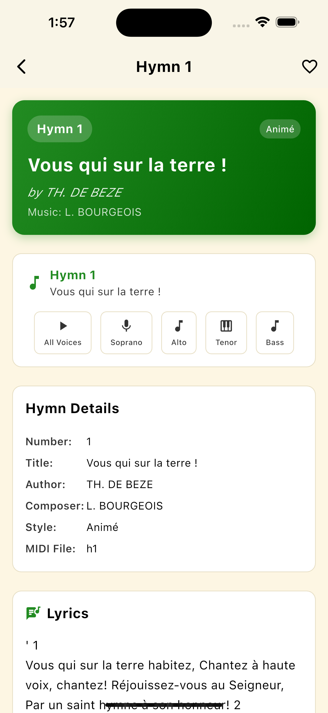

# 🎵 Hymnes & Louanges

A beautiful Flutter application for French Adventist hymns with MIDI audio playback, featuring clean architecture and elegant design.

## ✨ Features

- **🔍 Advanced Search / Recherche Avancée**: Search hymns by number, title, author, or lyrics / Recherchez vos hymnes par numéro, titre, auteur ou paroles
- **💾 Smart Storage / Sauvegarde Intelligente**: Save hymns locally or in the cloud with automatic sync / Sauvegardez vos hymnes en local ou dans le cloud avec synchronisation automatique
- **🎯 Theme Filtering / Filtrage par Thème**: Filter hymns by theme or sub-theme for easy navigation / Filtrez les hymnes par thème ou sous-thème pour une navigation facile
- **🌓 Dark/Light Mode / Mode Sombre/Clair**: Choose between light and dark mode according to your preferences / Choisissez entre mode clair et mode sombre selon vos préférences
- **🌍 Multilingual / Multilingue**: Select app language (French or English) / Sélectionnez la langue de l'application (Français ou Anglais)
- **🎵 Complete Audio / Audio Complet**: Listen to complete music or each voice separately: soprano, alto, tenor, bass / Écoutez la musique complète ou chaque voix séparément : soprano, alto, ténor, basse
- **📜 Musical Scores / Partitions Musicales**: View the musical score for each hymn / Visualisez la partition musicale pour chaque hymne
- **📚 Hymn History / Histoire des Hymnes**: Discover the history of certain hymns / Découvrez l'histoire de certains hymnes
- **⭐ Favorites / Favoris**: Mark your favorite hymns for quick access / Marquez vos hymnes préférés pour un accès rapide
- **📱 Modern Interface / Interface Moderne**: Elegant and responsive design with Material Design 3 / Design élégant et responsive avec Material Design 3
- **🎨 Elegant Theme / Thème Élégant**: Forest Green, Gold, and White color palette / Palette de couleurs Forest Green, Gold et White

## 📱 Preview

<div align="center">
  
  <p><em>Home screen showing hymn list with search functionality</em></p>
</div>

## 🚀 Quick Start

### Prerequisites

Before you begin, ensure you have the following installed:

- **Flutter SDK**: 3.2.3 or higher
- **Dart SDK**: 3.0.0 or higher
- **Git**: For cloning the repository
- **IDE**: Android Studio, VS Code, or IntelliJ with Flutter plugin

### Installation Steps

1. **Clone the Repository**

   ```bash
   git clone https://github.com/yourusername/hymnes.git
   cd hymnes
   ```

2. **Install Flutter Dependencies**

   ```bash
   flutter pub get
   ```

3. **Generate Localization Files**

   ```bash
   flutter gen-l10n
   ```

4. **Generate Code (Optional - for Hive adapters)**

   ```bash
   flutter packages pub run build_runner build
   ```

5. **Run the Application**
   ```bash
   flutter run
   ```

### Platform-Specific Setup

#### For Android Development

- Install Android Studio
- Set up Android SDK (API level 21 or higher)
- Enable USB debugging on your device or use an emulator

#### For iOS Development (macOS only)

- Install Xcode from the App Store
- Install iOS Simulator
- Ensure you have a valid Apple Developer account for device testing

#### For Web Development

- No additional setup required
- Run with: `flutter run -d chrome`

## 🛠️ Technology Stack

- **Framework**: Flutter 3.2.3+
- **Language**: Dart 3.0.0+
- **State Management**: BLoC Pattern (flutter_bloc 8.1.3)
- **Audio**: Just Audio 0.9.36 for MIDI playback
- **Storage**: ObjectBox 5.0.0 for local data persistence + Firebase Firestore for cloud sync
- **Authentication**: Firebase Auth for user management
- **Analytics**: PostHog for user behavior tracking
- **Error Tracking**: Sentry for crash reporting
- **Navigation**: Go Router 12.1.3
- **Internationalization**: Built-in Flutter i18n
- **Architecture**: Clean Architecture with Repository Pattern

## 📦 Key Dependencies

```yaml
dependencies:
  flutter_bloc: ^8.1.3 # State management
  just_audio: ^0.9.36 # Audio playback
  hive_flutter: ^1.1.0 # Local storage
  firebase_core: ^2.24.2 # Firebase core
  cloud_firestore: ^4.13.6 # Cloud database
  firebase_auth: ^4.15.3 # Authentication
  posthog_flutter: ^3.0.0 # Analytics
  sentry_flutter: ^7.13.2 # Error tracking
  shared_preferences: ^2.2.2 # Settings storage
  equatable: ^2.0.5 # Value equality
  gap: ^3.0.1 # Spacing widget
  package_info_plus: ^4.2.0 # App info
```

## 🏗️ Project Structure

```
lib/
├── core/                     # Core functionality
│   ├── models/              # Data models (Hymn)
│   ├── providers/           # Global providers (Language)
│   ├── repositories/        # Data access layer
│   └── services/            # Business logic services
├── features/                # Feature modules
│   ├── audio/              # Audio playback (BLoC)
│   ├── favorites/          # Favorites management
│   ├── hymns/              # Hymns feature (BLoC)
│   ├── midi/               # MIDI playback (BLoC)
│   └── search/             # Search functionality
├── l10n/                   # Localization files
│   ├── app_en.arb          # English translations
│   └── app_fr.arb          # French translations
├── presentation/           # UI layer
│   └── screens/            # App screens
└── shared/                 # Shared components
    ├── constants/          # App constants & colors
    ├── utils/              # Utility functions
    └── widgets/            # Reusable widgets
```

## 🎵 Audio Features

### MIDI Playback

- **All Voices**: Play complete MIDI arrangements
- **Individual Voices**: Soprano, Alto, Tenor, Bass
- **Playback Controls**: Play, pause, stop, seek
- **Volume Control**: Adjustable audio levels

### Audio Files

MIDI files should be placed in `assets/midi/` with the naming convention:

- `h001.mid` for Hymn 1
- `h002.mid` for Hymn 2
- etc.

## ☁️ Cloud Synchronization

### Favorites Sync

- **Offline-First**: Favorites are stored locally for instant access
- **Optional Authentication**: Use the app without signing in - all features work offline
- **Cloud Backup**: Automatic sync with Firebase Firestore when authenticated
- **Smart Sync**: Only syncs when user adds/removes favorites or logs in
- **Cross-Device**: Access your favorites on any device when signed in
- **Privacy**: Local favorites remain available even when offline

### Authentication

- **Optional Sign-In**: Authentication is completely optional
- **Full App Access**: All features work without signing in
- **Firebase Auth**: Secure user authentication when desired
- **Multiple Providers**: Email/password and social login options
- **Session Management**: Automatic session handling
- **Privacy**: User data is encrypted and secure

## 🌐 Localization

The app supports French and English:

- **French**: Default language
- **English**: Available through settings
- **Adding Languages**: Add new `.arb` files in `lib/l10n/`

## 🧪 Development

### Running Tests

```bash
flutter test
```

### Code Generation

```bash
# Generate localization files
flutter gen-l10n

# Generate Hive adapters (if needed)
flutter packages pub run build_runner build --delete-conflicting-outputs
```

### Linting

```bash
flutter analyze
```

## 📱 Building for Production

### Android APK

```bash
flutter build apk --release
```

### Android App Bundle

```bash
flutter build appbundle --release
```

### iOS App

```bash
flutter build ios --release
```

### Web App

```bash
flutter build web --release
```

## 🎯 State Management

The app uses **BLoC Pattern** consistently:

### Available BLoCs

- **LanguageBloc**: Language selection and persistence
- **MidiBloc**: MIDI playback control
- **AudioBloc**: Audio playback management
- **HymnsBloc**: Hymn data and search management

### Usage Example

```dart
// Dispatch events
context.read<MidiBloc>().add(PlayMidi('h001'));

// Listen to state
BlocBuilder<MidiBloc, MidiState>(
  builder: (context, state) {
    if (state is MidiLoaded && state.isPlaying) {
      return Text('Playing: ${state.currentMidiFile}');
    }
    return Text('Stopped');
  },
)
```

## 🔧 Troubleshooting

### Common Issues

1. **Dependencies not found**

   ```bash
   flutter clean
   flutter pub get
   ```

2. **Localization not working**

   ```bash
   flutter gen-l10n
   flutter run
   ```

3. **Build errors**

   ```bash
   flutter clean
   flutter pub get
   flutter packages pub run build_runner build --delete-conflicting-outputs
   ```

4. **Audio not playing**
   - Ensure MIDI files are in `assets/midi/` directory
   - Check that assets are declared in `pubspec.yaml`
   - Verify device audio is not muted

### Platform-Specific Issues

#### Android

- Minimum SDK version: 21
- If build fails, check `android/app/build.gradle` configuration

#### iOS

- Requires Xcode 12 or later
- Ensure iOS deployment target is 11.0 or higher

#### Web

- Audio playback may have limitations in some browsers
- Use Chrome for best compatibility

## 📊 Performance

### Optimization Tips

- MIDI files are loaded on-demand
- Images and assets are cached automatically
- BLoC pattern ensures efficient state updates
- Local storage with Hive for fast data access

## 🤝 Contributing

1. **Fork** the repository
2. **Create** a feature branch: `git checkout -b feature/amazing-feature`
3. **Commit** changes: `git commit -m 'Add amazing feature'`
4. **Push** to branch: `git push origin feature/amazing-feature`
5. **Open** a Pull Request

### Development Guidelines

- Follow Flutter/Dart style guidelines
- Use BLoC pattern for state management
- Add tests for new features
- Update documentation as needed
- Ensure localization for both languages

## 📄 License

This project is licensed under the MIT License - see the [LICENSE](LICENSE) file for details.

## 🙏 Acknowledgments

- **Flutter Team**: For the amazing framework
- **BLoC Library**: For excellent state management
- **Just Audio**: For reliable audio playback
- **Material Design**: For design guidelines
- **Adventist Hymnal**: For the hymn content

## 📞 Support

Need help? Here's how to get support:

- **🐛 Bug Reports**: [Open an issue](https://github.com/yourusername/hymnes/issues)
- **💡 Feature Requests**: [Submit a request](https://github.com/yourusername/hymnes/issues)
- **📧 Questions**: Contact through GitHub issues

## 🌟 Show Your Support

If this project helps you, please consider:

- ⭐ **Starring** the repository
- 🐛 **Reporting** bugs you find
- 💡 **Suggesting** new features
- 🤝 **Contributing** to the codebase

---

**Built with ❤️ using Flutter and BLoC**

_"Make a joyful noise unto the Lord, all ye lands!"_ - Psalm 100:1
