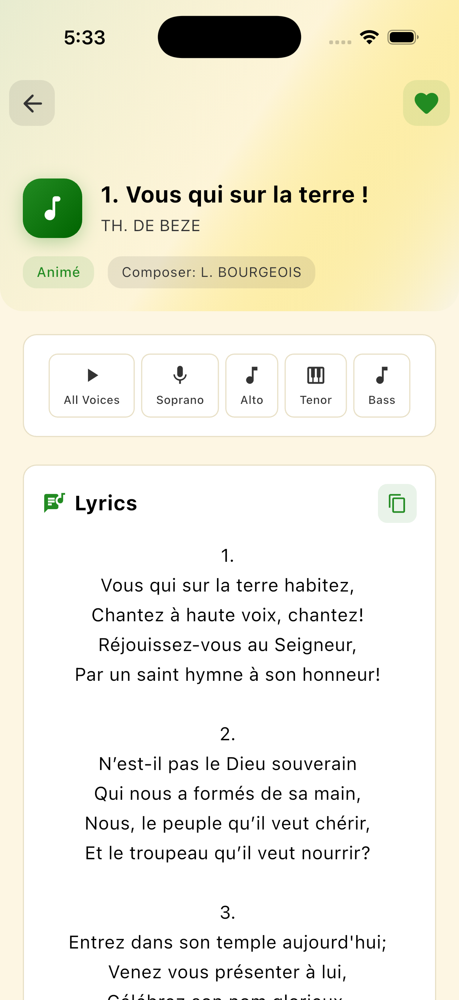

# 🎵 Hymnes & Louanges

A beautiful Flutter application for French Adventist hymns with audio playback, lyrics display, and music sheet viewing capabilities. Features offline-first architecture, background audio playback, and automatic hymn synchronization.

## ✨ Features

- **🔍 Advanced Search / Recherche Avancée**: Search hymns by number, title, author, or lyrics / Recherchez vos hymnes par numéro, titre, auteur ou paroles
- **💾 Smart Storage / Sauvegarde Intelligente**: Save hymns locally or in the cloud with automatic sync / Sauvegardez vos hymnes en local ou dans le cloud avec synchronisation automatique
- **🔄 Automatic Hymns Sync / Synchronisation Automatique**: Offline-first hymns sync with Firebase. Updates automatically in the background with rollback safety / Synchronisation hors ligne avec Firebase. Mises à jour automatiques en arrière-plan avec sécurité de restauration
- **🎯 Theme Filtering / Filtrage par Thème**: Filter hymns by theme or sub-theme for easy navigation / Filtrez les hymnes par thème ou sous-thème pour une navigation facile
- **🌓 Dark/Light Mode / Mode Sombre/Clair**: Choose between light and dark mode according to your preferences / Choisissez entre mode clair et mode sombre selon vos préférences
- **🌍 Multilingual / Multilingue**: Automatic language detection on first launch. Select app language (French or English) / Détection automatique de la langue au premier lancement. Sélectionnez la langue de l'application (Français ou Anglais)
- **🎵 Complete Audio / Audio Complet**: Listen to complete music or each voice separately: soprano, alto, tenor, bass, countertenor, baritone / Écoutez la musique complète ou chaque voix séparément : soprano, alto, ténor, basse, contreténor, baryton
- **🎧 Background Audio / Audio en Arrière-plan**: Music continues playing in the background with lock screen and notification controls / La musique continue de jouer en arrière-plan avec contrôles sur l'écran de verrouillage et les notifications
- **📜 Musical Scores / Partitions Musicales**: View the musical score for each hymn / Visualisez la partition musicale pour chaque hymne
- **📚 Hymn History / Histoire des Hymnes**: Discover the history of certain hymns / Découvrez l'histoire de certains hymnes
- **⭐ Favorites / Favoris**: Mark your favorite hymns for quick access. Syncs across devices when signed in / Marquez vos hymnes préférés pour un accès rapide. Synchronisation entre appareils lors de la connexion
- **💬 Feedback System / Système de Commentaires**: Submit feedback, report bugs, or suggest improvements directly from the app / Soumettez des commentaires, signalez des bugs ou suggérez des améliorations directement depuis l'application
- **📱 Modern Interface / Interface Moderne**: Elegant and responsive design with Material Design 3 / Design élégant et responsive avec Material Design 3
- **🎨 Elegant Theme / Thème Élégant**: Forest Green, Gold, and White color palette / Palette de couleurs Forest Green, Gold et White

## 📱 Preview

<div align="center">
  
  <p><em>Home screen showing hymn list with search functionality</em></p>
</div>

## 🚀 Quick Start

### Prerequisites

Before you begin, ensure you have the following installed:

- **Flutter SDK**: 3.29.2 or higher
- **Dart SDK**: 3.0.0 or higher
- **Git**: For cloning the repository
- **IDE**: Android Studio, VS Code, or IntelliJ with Flutter plugin

### Installation Steps

1. **Clone the Repository**

   ```bash
   git clone https://github.com/yourusername/hymnes.git
   cd hymnes
   ```

2. **Install Flutter Dependencies**

   ```bash
   flutter pub get
   ```

3. **Generate Localization Files**

   ```bash
   flutter gen-l10n
   ```

4. **Generate Code (Optional - for Hive adapters)**

   ```bash
   flutter packages pub run build_runner build
   ```

5. **Run the Application**
   ```bash
   flutter run
   ```

### Platform-Specific Setup

#### For Android Development

- Install Android Studio
- Set up Android SDK (API level 21 or higher)
- Enable USB debugging on your device or use an emulator

#### For iOS Development (macOS only)

- Install Xcode from the App Store
- Install iOS Simulator
- Ensure you have a valid Apple Developer account for device testing

#### For Web Development

- No additional setup required
- Run with: `flutter run -d chrome`

## 🛠️ Technology Stack

- **Framework**: Flutter 3.2.3+
- **Language**: Dart 3.0.0+
- **State Management**: BLoC Pattern (flutter_bloc 8.1.3)
- **Audio**: Just Audio 0.9.36 + Audio Session for background playback
- **Storage**:
  - ObjectBox 5.0.0 for local data persistence
  - Firebase Firestore for favorites cloud sync
  - Firebase Realtime Database for hymns metadata
  - Firebase Storage for hymns JSON files
- **Authentication**: Firebase Auth (Email, Google, Apple Sign-In)
- **Analytics**: PostHog for user behavior tracking and DAU monitoring
- **Error Tracking**: Sentry for crash reporting and user feedback
- **Navigation**: Go Router 12.1.3
- **Internationalization**: Built-in Flutter i18n with automatic language detection
- **Architecture**: Clean Architecture with Repository Pattern and SOLID principles

## 📦 Key Dependencies

```yaml
dependencies:
  flutter_bloc: ^8.1.3 # State management
  just_audio: ^0.9.36 # Audio playback
  audio_session: ^0.1.19 # Background audio support
  objectbox: ^5.0.0 # Local database
  firebase_core: ^4.1.1 # Firebase core
  firebase_auth: ^6.1.0 # Authentication
  firebase_database: ^12.0.2 # Realtime Database for hymns metadata
  firebase_storage: ^13.0.0 # Storage for hymns JSON files
  cloud_firestore: ^6.0.2 # Cloud database for favorites
  posthog_flutter: ^5.0.0 # Analytics and user tracking
  sentry_flutter: ^9.6.0 # Error tracking and feedback
  shared_preferences: ^2.2.2 # Settings storage
  equatable: ^2.0.5 # Value equality
  gap: ^3.0.1 # Spacing widget
  package_info_plus: ^4.2.0 # App info
  connectivity_plus: ^6.0.5 # Network connectivity
  go_router: ^12.1.3 # Navigation
```

## 🏗️ Project Structure

```
lib/
├── core/                     # Core functionality
│   ├── models/              # Data models (Hymn)
│   ├── providers/           # Global providers (Language)
│   ├── repositories/        # Data access layer
│   └── services/            # Business logic services
├── features/                # Feature modules
│   ├── audio/              # Audio playback (BLoC)
│   ├── favorites/          # Favorites management
│   ├── hymns/              # Hymns feature (BLoC)
│   ├── midi/               # MIDI playback (BLoC)
│   └── search/             # Search functionality
├── l10n/                   # Localization files
│   ├── app_en.arb          # English translations
│   └── app_fr.arb          # French translations
├── presentation/           # UI layer
│   └── screens/            # App screens
└── shared/                 # Shared components
    ├── constants/          # App constants & colors
    ├── utils/              # Utility functions
    └── widgets/            # Reusable widgets
```

## 🎵 Audio Features

### MP3 Playback

- **All Voices**: Play complete MP3 arrangements from online sources
- **Individual Voices**: Soprano, Alto, Tenor, Bass, Countertenor, Baritone
- **Playback Controls**: Play, pause, stop, seek, loop toggle
- **Background Playback**: Music continues playing when app is in background
- **Notification Controls**: Control playback from lock screen and notification panel
- **Volume Control**: Adjustable audio levels
- **Auto-retry**: Automatic retry on connection failures

### Audio Sources

- **All Voices**: Streamed from `troisanges.org`
- **Individual Voices**: Hosted on GitHub Pages

## ☁️ Cloud Synchronization

### Hymns Sync

- **Offline-First**: Hymns are stored locally for instant access
- **Automatic Updates**: Background sync checks for new hymn versions every 24 hours
- **Multi-Layer Validation**: 5-layer validation ensures data integrity
- **Automatic Rollback**: Failed updates automatically revert to previous working version
- **Version Blacklisting**: Problematic versions are automatically blacklisted
- **Manual Control**: Check for updates, revert, or reset from Settings
- **Silent Updates**: Updates happen in background without interrupting user

### Favorites Sync

- **Offline-First**: Favorites are stored locally for instant access
- **Optional Authentication**: Use the app without signing in - all features work offline
- **Cloud Backup**: Automatic sync with Firebase Firestore when authenticated
- **Smart Sync**: Bidirectional sync with conflict resolution based on timestamps
- **Cross-Device**: Access your favorites on any device when signed in
- **Pending Operations**: Operations queued when offline, synced when back online
- **Privacy**: Local favorites remain available even when offline

### Authentication

- **Optional Sign-In**: Authentication is completely optional
- **Full App Access**: All features work without signing in
- **Firebase Auth**: Secure user authentication when desired
- **Multiple Providers**: Email/password, Google Sign-In, and Apple Sign-In
- **Session Management**: Automatic session handling
- **Privacy**: User data is encrypted and secure

## 🌐 Localization

The app supports French and English:

- **Automatic Detection**: Detects device language on first launch
- **French**: Default if device is set to French
- **English**: Default if device is set to English or any other language
- **Manual Selection**: Language selector available in onboarding and settings
- **Persistent**: Language preference is saved and remembered
- **Adding Languages**: Add new `.arb` files in `lib/l10n/`

## 🧪 Development

### Running Tests

```bash
flutter test
```

### Code Generation

```bash
# Generate localization files
flutter gen-l10n

# Generate Hive adapters (if needed)
flutter packages pub run build_runner build --delete-conflicting-outputs
```

### Linting

```bash
flutter analyze
```

## 📱 Building for Production

### Android APK

```bash
flutter build apk --release
```

### Android App Bundle

```bash
flutter build appbundle --release
```

### iOS App

```bash
flutter build ios --release
```

### Web App

```bash
flutter build web --release
```

## 🎯 State Management

The app uses **BLoC Pattern** consistently:

### Available BLoCs

- **LanguageBloc**: Language selection and persistence with auto-detection
- **AudioBloc**: Audio playback management with background support
- **AuthBloc**: User authentication and session management
- **FavoritesBloc**: Favorites management with cloud sync
- **ThemeBloc**: Theme selection (light/dark mode)

### Usage Example

```dart
// Dispatch events
context.read<AudioBloc>().add(PlayAudio(
  '001',
  voiceType: VoiceType.allVoices,
  hymnTitle: 'Hymn Title',
));

// Listen to state
BlocBuilder<AudioBloc, AudioState>(
  builder: (context, state) {
    if (state is AudioLoaded && state.isPlaying) {
      return Text('Playing: ${state.currentHymnNumber}');
    }
    return Text('Stopped');
  },
)
```

## 🔧 Troubleshooting

### Common Issues

1. **Dependencies not found**

   ```bash
   flutter clean
   flutter pub get
   ```

2. **Localization not working**

   ```bash
   flutter gen-l10n
   flutter run
   ```

3. **Build errors**

   ```bash
   flutter clean
   flutter pub get
   flutter packages pub run build_runner build --delete-conflicting-outputs
   ```

4. **Audio not playing**
   - Check internet connection (MP3 files are streamed)
   - Verify device audio is not muted
   - Check audio permissions in device settings
   - For background playback, ensure app has audio background mode enabled

### Platform-Specific Issues

#### Android

- Minimum SDK version: 21
- If build fails, check `android/app/build.gradle` configuration

#### iOS

- Requires Xcode 12 or later
- Ensure iOS deployment target is 11.0 or higher

#### Web

- Audio playback may have limitations in some browsers
- Use Chrome for best compatibility

## 📊 Performance

### Optimization Tips

- Audio files are streamed on-demand
- Hymns data cached locally with ObjectBox for instant access
- Images and assets are cached automatically
- BLoC pattern ensures efficient state updates
- Offline-first architecture minimizes network usage
- Background sync happens during idle time

## 🤝 Contributing

1. **Fork** the repository
2. **Create** a feature branch: `git checkout -b feature/amazing-feature`
3. **Commit** changes: `git commit -m 'Add amazing feature'`
4. **Push** to branch: `git push origin feature/amazing-feature`
5. **Open** a Pull Request

### Development Guidelines

- Follow Flutter/Dart style guidelines
- Use BLoC pattern for state management
- Add tests for new features
- Update documentation as needed
- Ensure localization for both languages

## 📄 License

This project is licensed under the MIT License - see the [LICENSE](LICENSE) file for details.

## 📚 Documentation

Comprehensive documentation is available in the `docs/` folder:

- **[Documentation Index](docs/README.md)**: Overview of all documentation
- **[Hymns Sync System](docs/hymns-sync/)**: Firebase setup and sync implementation
- **[User Tracking](docs/tracking/)**: PostHog integration and analytics
- **[Feedback System](docs/feedback/)**: User feedback collection
- **[Localization](docs/localization/)**: Language detection and selection
- **[Development Guides](docs/development/)**: Branch protection, SOLID principles, release guides

## 🙏 Acknowledgments

- **Flutter Team**: For the amazing framework
- **BLoC Library**: For excellent state management
- **Just Audio**: For reliable audio playback with background support
- **Firebase**: For cloud services and real-time sync
- **PostHog**: For user analytics and tracking
- **Sentry**: For error tracking and monitoring
- **Material Design**: For design guidelines
- **Adventist Hymnal**: For the hymn content

## 📞 Support

Need help? Here's how to get support:

- **🐛 Bug Reports**: [Open an issue](https://github.com/yourusername/hymnes/issues)
- **💡 Feature Requests**: [Submit a request](https://github.com/yourusername/hymnes/issues)
- **📧 Questions**: Contact through GitHub issues

## 🌟 Show Your Support

If this project helps you, please consider:

- ⭐ **Starring** the repository
- 🐛 **Reporting** bugs you find
- 💡 **Suggesting** new features
- 🤝 **Contributing** to the codebase

---

## 📱 Current Version

**v1.1.2+30** - Latest features:

- ✅ Background audio playback with notification controls
- ✅ Automatic hymns synchronization
- ✅ Enhanced user tracking and analytics
- ✅ User feedback system
- ✅ Automatic language detection
- ✅ Improved favorites sync

---

**Built with ❤️ using Flutter and BLoC**

_"Make a joyful noise unto the Lord, all ye lands!"_ - Psalm 100:1
